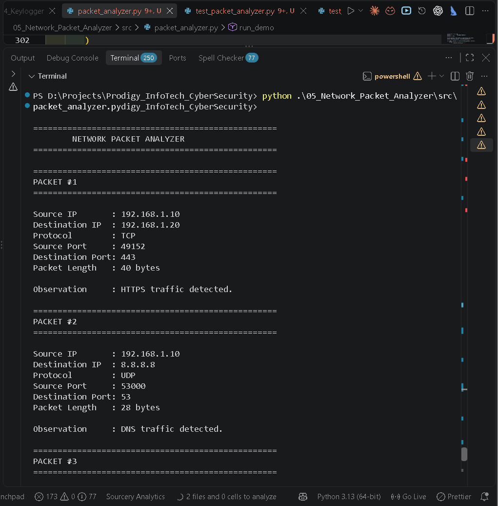
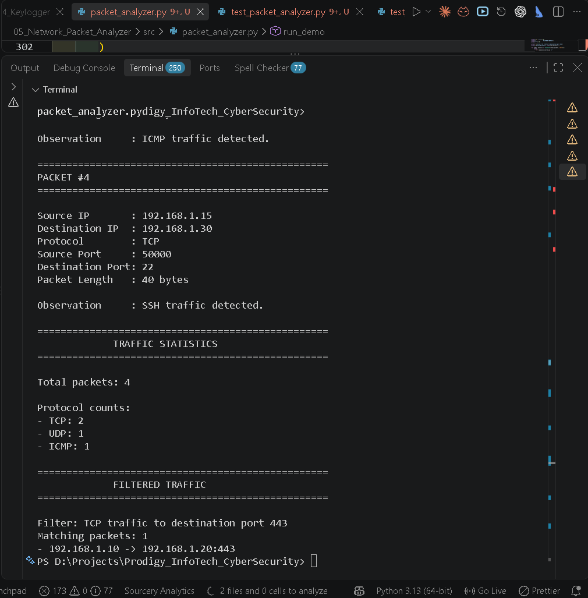
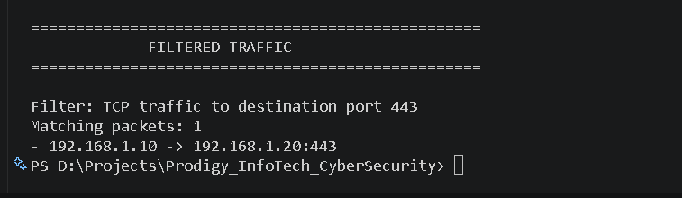
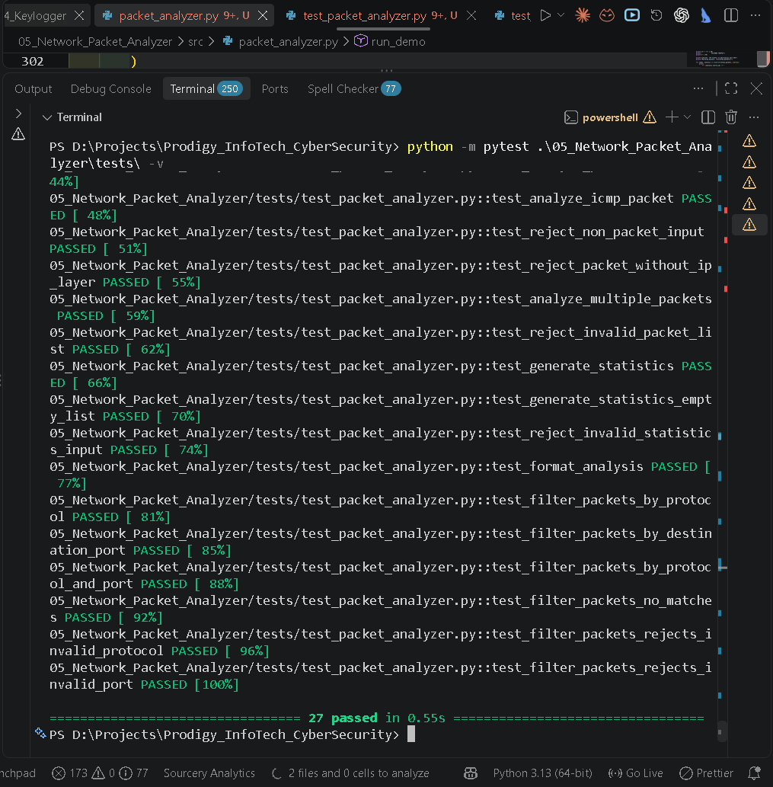

# Task 05 — Network Packet Analyzer

## Cyber Security Internship — Prodigy InfoTech

---

## Overview

This project is **Task 05 — Network Packet Analyzer**, completed as part of my **Cyber Security Internship at Prodigy InfoTech**.

The objective of this task is to develop a Python-based network packet analyzer that can inspect controlled packet structures and extract useful information for cybersecurity analysis.

The analyzer examines:

- Source IP address
- Destination IP address
- Network protocol
- Source port
- Destination port
- Packet length
- Basic traffic observations

The project also provides traffic statistics and filtering functionality to demonstrate how network traffic can be organized and analyzed from a defensive cybersecurity perspective.

The implementation uses **Scapy** to construct and inspect packet structures.

> **Important:** This project is designed as a controlled educational implementation. It analyzes predefined/generated packet structures and does not perform unrestricted live packet capture or covert network monitoring.

---

# Task Objectives

The primary objectives of this task are:

1. Understand the basic structure of network packets.
2. Understand fundamental TCP/IP networking concepts.
3. Identify common network protocols.
4. Extract source and destination IP addresses.
5. Extract TCP and UDP port information.
6. Determine packet lengths.
7. Generate basic observations from packet characteristics.
8. Generate protocol-based traffic statistics.
9. Filter analyzed traffic using specific criteria.
10. Practice Python-based network security analysis.
11. Use Scapy for packet construction and inspection.
12. Implement automated tests for security-related functionality.
13. Understand how packet analysis supports defensive cybersecurity.
14. Understand privacy and authorization considerations associated with network monitoring.
15. Practice interpreting network indicators in the context of a broader security investigation.

---

# Project Goals

The project was designed around the following workflow:

Network Packet Understanding  
↓  
Protocol Identification  
↓  
IP and Port Extraction  
↓  
Packet Length Analysis  
↓  
Traffic Observation  
↓  
Traffic Statistics  
↓  
Traffic Filtering  
↓  
Security Analysis  
↓  
Automated Testing

The goal is not to create a complete enterprise network monitoring platform.

Instead, this project provides a practical foundation for understanding how packet structures can be represented, inspected, categorized, filtered, and tested using Python.

---

# Features

## 1. Packet Analysis

The analyzer extracts:

- Source IP
- Destination IP
- Protocol
- Source Port
- Destination Port
- Packet Length
- Observation

## 2. Protocol Detection

Supported classifications include:

- TCP
- UDP
- ICMP
- IP
- UNKNOWN

## 3. IP Address Extraction

For IP packets, the analyzer extracts the source and destination IP addresses.

Example:

    Source IP       : 192.168.1.10
    Destination IP  : 192.168.1.20

## 4. Port Extraction

For TCP and UDP packets, the analyzer extracts source and destination ports.

Example:

    Source Port     : 49152
    Destination Port: 443

For protocols where ports are not applicable:

    N/A

## 5. Packet Length Analysis

The analyzer records the packet length.

Example:

    Packet Length   : 40 bytes

Packet length is one attribute of the packet and is not independently used to determine whether traffic is malicious.

## 6. Traffic Observations

The analyzer generates basic observations based on protocol and destination ports.

Examples:

- HTTPS traffic detected.
- HTTP traffic detected.
- DNS traffic detected.
- SSH traffic detected.
- ICMP traffic detected.

These observations provide traffic context and are not complete security verdicts.

## 7. Traffic Statistics

The analyzer calculates:

- Total packet count
- TCP count
- UDP count
- ICMP count
- Other protocol counts when applicable

Example:

    Total packets: 4

    Protocol counts:
    - TCP: 2
    - UDP: 1
    - ICMP: 1

## 8. Traffic Filtering

Traffic can be filtered using:

- Protocol
- Destination port
- Protocol + destination port

Example:

    Protocol        : TCP
    Destination Port: 443

## 9. Human-Readable Output

Packet information is formatted into structured console output containing:

- Source IP
- Destination IP
- Protocol
- Source port
- Destination port
- Packet length
- Observation

## 10. Controlled Demonstration

The demonstration uses generated packet structures representing:

- HTTPS
- DNS
- ICMP
- SSH

No unrestricted live packet capture is required.

## 11. Automated Testing

The project includes a pytest test suite covering packet analysis, protocol detection, port extraction, formatting, statistics, filtering, and invalid input handling.

Final test count:

**27 tests**

---

# Components

## 1. Packet Analyzer

**File:** `src/packet_analyzer.py`

Responsibilities:

- Packet analysis
- Protocol detection
- IP extraction
- Port extraction
- Packet length calculation
- Observation generation
- Output formatting
- Multiple-packet analysis
- Traffic filtering
- Statistics generation
- Controlled demonstration

## 2. Packet Analysis Data Model

The `PacketAnalysis` data structure represents an analyzed packet.

Fields:

- `source_ip`
- `destination_ip`
- `protocol`
- `source_port`
- `destination_port`
- `packet_length`
- `observation`

## 3. Protocol Detection Component

Identifies:

- TCP
- UDP
- ICMP
- IP
- UNKNOWN

## 4. Port Extraction Component

Extracts TCP and UDP source and destination ports.

For ICMP and other protocols without ports:

    Source Port      : N/A
    Destination Port : N/A

## 5. Observation Generation Component

Generates basic descriptions using protocol and destination-port information.

Examples:

- TCP + 443 → HTTPS traffic detected.
- TCP + 80 → HTTP traffic detected.
- UDP + 53 → DNS traffic detected.
- TCP + 22 → SSH traffic detected.
- ICMP → ICMP traffic detected.

## 6. Traffic Filtering Component

Supports:

- Protocol filtering
- Destination-port filtering
- Combined protocol and destination-port filtering

Protocol matching is case-insensitive.

## 7. Statistics Component

Provides:

- Total packet count
- Protocol counts

## 8. Test Suite

**File:** `tests/test_packet_analyzer.py`

The test suite validates the analyzer using controlled Scapy packet structures.

---

# Implementation Approach

The project follows this workflow:

    CONTROLLED PACKET
           ↓
    PACKET ANALYSIS
           ↓
    IP DATA + PROTOCOL + PORTS
           ↓
    PACKET LENGTH
           ↓
    OBSERVATION GENERATION
           ↓
    PacketAnalysis OBJECT
           ↓
    ┌─────────────────┬─────────────────┐
    │                 │
    STATISTICS      FILTERING
    │                 │
    └─────────────────┴─────────────────┘
                     ↓
             HUMAN-READABLE OUTPUT

---

# Packet Analysis

The analyzer uses Scapy to inspect supported packet structures.

For IP packets it extracts:

- Source IP
- Destination IP

For TCP and UDP packets it additionally extracts:

- Source port
- Destination port

It also determines:

- Protocol
- Packet length
- Basic traffic observation

---

# Protocol Detection

## TCP

TCP traffic is identified when a TCP layer is present.

    Protocol: TCP

The demonstration includes:

- HTTPS → 443
- HTTP → 80
- SSH → 22

## UDP

UDP traffic is identified when a UDP layer is present.

    Protocol: UDP

The demonstration includes:

- DNS → 53

## ICMP

ICMP traffic is identified when an ICMP layer is present.

    Protocol: ICMP

Because ICMP does not use TCP/UDP ports:

    Source Port      : N/A
    Destination Port : N/A

## IP

If an IP layer exists but no explicitly supported transport protocol is detected:

    IP

## Unknown

Unsupported packet structures can be classified as:

    UNKNOWN

---

# IP Address Extraction

The analyzer extracts source and destination IP addresses.

Example:

    Source IP       : 192.168.1.10
    Destination IP  : 192.168.1.20

These addresses represent the communication endpoints in the analyzed packet.

---

# Port Extraction

TCP and UDP packets contain source and destination ports.

Example:

    Source Port     : 49152
    Destination Port: 443

Destination-port information is also used to generate traffic observations.

---

# Packet Length Analysis

The analyzer records packet length.

Example:

    Packet Length   : 40 bytes

Packet length can provide additional context but cannot independently determine whether traffic is legitimate or malicious.

---

# Traffic Observations

## HTTPS

TCP traffic directed toward port `443`:

    HTTPS traffic detected.

## HTTP

TCP traffic directed toward port `80`:

    HTTP traffic detected.

## DNS

UDP traffic directed toward port `53`:

    DNS traffic detected.

## SSH

TCP traffic directed toward port `22`:

    SSH traffic detected.

## ICMP

ICMP traffic:

    ICMP traffic detected.

### Observation Limitation

These observations are descriptive.

For example:

    TCP + destination port 443

may indicate HTTPS-related traffic, but the port alone does not establish whether the communication is safe, suspicious, or malicious.

Additional context is required.

---

# Traffic Statistics

Example output:

    ==================================================
                 TRAFFIC STATISTICS
    ==================================================

    Total packets: 4

    Protocol counts:
    - TCP: 2
    - UDP: 1
    - ICMP: 1

This provides a quick overview of the protocols represented in the analyzed dataset.

---

# Traffic Filtering

The analyzer provides:

`filter_packets()`

Supported filters:

- Protocol
- Destination port
- Protocol + destination port

## Protocol Filtering

Example:

    Protocol: TCP

## Destination-Port Filtering

Example:

    Destination Port: 443

## Combined Filtering

Example:

    Protocol        : TCP
    Destination Port: 443

This isolates TCP traffic directed toward port `443`.

---

# Filtering Demonstration

The demonstration applies:

    Filter: TCP traffic to destination port 443

Result:

    Matching packets: 1
    - 192.168.1.10 -> 192.168.1.20:443

---

# Example Demonstration

## Packet 1 — HTTPS

    Source IP       : 192.168.1.10
    Destination IP  : 192.168.1.20
    Protocol        : TCP
    Source Port     : 49152
    Destination Port: 443
    Packet Length   : 40 bytes

    Observation     : HTTPS traffic detected.

## Packet 2 — DNS

    Source IP       : 192.168.1.10
    Destination IP  : 8.8.8.8
    Protocol        : UDP
    Source Port     : 53000
    Destination Port: 53
    Packet Length   : 28 bytes

    Observation     : DNS traffic detected.

## Packet 3 — ICMP

    Source IP       : 192.168.1.20
    Destination IP  : 192.168.1.10
    Protocol        : ICMP
    Source Port     : N/A
    Destination Port: N/A
    Packet Length   : 28 bytes

    Observation     : ICMP traffic detected.

## Packet 4 — SSH

    Source IP       : 192.168.1.15
    Destination IP  : 192.168.1.30
    Protocol        : TCP
    Source Port     : 50000
    Destination Port: 22
    Packet Length   : 40 bytes

    Observation     : SSH traffic detected.

---

# Security Analysis

Network packet analysis is an important part of defensive cybersecurity.

Security analysts may inspect network traffic to investigate:

- Unexpected connections
- Unknown destinations
- Unusual protocols
- Unexpected service ports
- Repeated communication patterns
- Suspicious communication behavior
- Potential command-and-control indicators
- Potential data-transfer activity
- Network reconnaissance indicators

A single packet attribute should not automatically be treated as proof of malicious activity.

---

# SOC Analyst Perspective

Network telemetry can be one source of evidence during a SOC investigation.

For example:

    Protocol        : TCP
    Destination Port: 443
    Observation     : HTTPS traffic detected.

This does not answer:

- Which endpoint initiated the connection?
- Which process created the connection?
- Is the destination expected?
- Was there a DNS lookup before the connection?
- How frequently does the connection occur?
- Are there related endpoint alerts?
- Are there corresponding firewall or IDS/IPS events?

Additional telemetry is required for those questions.

---

# Investigation Workflow

    Network Observation
            ↓
    Identify Source
            ↓
    Identify Destination
            ↓
    Identify Protocol
            ↓
    Identify Service / Port
            ↓
    Review DNS Activity
            ↓
    Identify Endpoint Process
            ↓
    Review EDR / IDS / Firewall Data
            ↓
    Correlate Security Events
            ↓
    Continue Investigation Based on Evidence

---

# Security Correlation

Network information can be correlated with:

- Network Traffic
- DNS Logs
- Endpoint Processes
- Authentication Events
- Firewall Logs
- IDS/IPS Alerts
- EDR Telemetry

Correlation provides additional context for security investigations.

---

# Input Validation

The implementation validates important inputs such as:

- Packet objects
- Analysis collections
- Protocol filters
- Destination-port filters

Invalid values are rejected instead of silently producing potentially incorrect results.

This improves:

- Reliability
- Predictability
- Maintainability
- Testability

---

# Automated Testing

The final implementation contains:

**27 tests**

The test suite validates:

- Protocol detection
- Port extraction
- Packet analysis
- Packet formatting
- Multiple packet analysis
- Traffic statistics
- Traffic filtering
- Invalid input handling

---

# Testing Coverage

## Protocol Detection

Tests cover:

- TCP
- UDP
- ICMP
- IP
- UNKNOWN

## Port Extraction

Tests cover:

- TCP source port
- TCP destination port
- UDP source port
- UDP destination port
- ICMP without ports

## Packet Analysis

Tests validate:

- Source IP
- Destination IP
- Protocol
- Source Port
- Destination Port
- Packet Length
- Observation

## Formatting

Tests verify readable packet-analysis output.

## Multiple Packet Analysis

Tests verify processing of multiple packets.

## Statistics

Tests verify:

- Total packet count
- Protocol counts

## Filtering

Tests verify:

- Protocol filtering
- Destination-port filtering
- Combined filtering
- No-match filtering
- Invalid protocol input
- Invalid destination-port input

---

# Test Result

Final result:

    27 passed in 0.50s

Command:

    python -m pytest .\05_Network_Packet_Analyzer\tests -v

---

# Syntax Verification

Command:

    python -m py_compile .\05_Network_Packet_Analyzer\src\packet_analyzer.py

The command completed successfully without syntax errors.

---

# Technologies Used

## Python

Primary programming language.

## Scapy

Used to construct and inspect controlled packet structures.

Version:

    2.7.0

## Pytest

Used for automated testing.

Version:

    9.1.1

## Visual Studio Code

Development environment.

## Git

Source-code version control.

## GitHub

Repository hosting and documentation.

---

# Requirements

- Python 3.11+
- Scapy
- Pytest

Development environment:

    Python : 3.11.9
    Scapy  : 2.7.0
    Pytest : 9.1.1

---

# Installation

Install dependencies:

    python -m pip install scapy pytest

Verify Python:

    python --version

Verify Scapy:

    python -c "import scapy; print(scapy.__version__)"

Verify Pytest:

    python -m pytest --version

---

# Running the Analyzer

From the repository root:

    python .\05_Network_Packet_Analyzer\src\packet_analyzer.py

The program displays:

1. Packet analysis
2. Source and destination information
3. Protocol information
4. Port information
5. Packet length
6. Traffic observations
7. Protocol statistics
8. Filtered traffic

---

# Expected Demonstration Output

Expected statistics:

    Total packets: 4

    Protocol counts:
    - TCP: 2
    - UDP: 1
    - ICMP: 1

Expected filter:

    Filter: TCP traffic to destination port 443
    Matching packets: 1
    - 192.168.1.10 -> 192.168.1.20:443

---

# Running the Automated Tests

Run:

    python -m pytest .\05_Network_Packet_Analyzer\tests -v

Expected result:

    27 passed

---

# Syntax Check

Run:

    python -m py_compile .\05_Network_Packet_Analyzer\src\packet_analyzer.py

A successful execution produces no error output.

---

# Project Structure

    05_Network_Packet_Analyzer/
    │
    ├── README.md
    │
    ├── screenshots/
    │   ├── 01_packet_analysis.png
    │   ├── 02_traffic_statistics.png
    │   ├── 03_filtered_traffic.png
    │   └── 04_automated_tests.png
    │
    ├── src/
    │   ├── __init__.py
    │   └── packet_analyzer.py
    │
    └── tests/
        └── test_packet_analyzer.py

---

# Evidence

## 1. Packet Analysis

This screenshot demonstrates:

- Source IP
- Destination IP
- Protocol
- Source port
- Destination port
- Packet length
- Observation

---

## 2. Traffic Statistics

This screenshot demonstrates the protocol statistics:

    Total packets: 4
    TCP: 2
    UDP: 1
    ICMP: 1

---

## 3. Filtered Traffic

This screenshot demonstrates:

    TCP traffic to destination port 443

Result:

    192.168.1.10 -> 192.168.1.20:443

---

## 4. Automated Tests

Final result:

    27 passed

---

# Controlled Demonstration

The current implementation intentionally uses controlled/generated packet structures.

It does not require unrestricted access to a network interface.

This approach keeps the project focused on:

- Packet structure
- Protocol identification
- IP analysis
- Port analysis
- Traffic statistics
- Traffic filtering
- Defensive security analysis
- Automated testing

---

# Privacy and Security Considerations

Real network traffic can contain sensitive information.

Packet captures may potentially expose:

- IP addresses
- DNS queries
- Application metadata
- Authentication information
- Session information
- Communication patterns
- Sensitive payload information

Real packet capture and analysis should only be performed when appropriate authorization has been obtained.

Sensitive packet captures should be:

- Stored securely
- Access-controlled
- Protected from unnecessary disclosure
- Used only for legitimate purposes
- Retained according to organizational requirements
- Deleted when no longer required

---

# Ethical and Legal Considerations

Network packet analysis is a legitimate cybersecurity technique when performed within an authorized environment.

Unauthorized interception or monitoring of network communications can create privacy, security, and legal concerns.

Any future extension involving live packet capture should only be performed:

- On systems owned by the analyst or organization
- In an authorized laboratory
- During an approved security assessment
- With explicit permission from the network owner

---

# Limitations

## 1. No Unrestricted Live Packet Capture

The current implementation analyzes controlled/generated packet structures.

## 2. Limited Protocol Support

The analyzer explicitly supports:

- TCP
- UDP
- ICMP
- IP
- UNKNOWN

It is not a complete protocol analyzer.

## 3. Basic Traffic Observations

Observations are based primarily on protocol and destination-port information.

The project does not perform advanced behavioral analysis.

## 4. No Deep Packet Inspection

The project does not implement comprehensive payload inspection.

## 5. No Threat Intelligence

The analyzer does not automatically query external:

- IP reputation services
- Domain reputation services
- Threat-intelligence feeds

## 6. No Intrusion Detection

The analyzer is not intended to replace a complete:

- IDS
- IPS
- SIEM
- EDR
- NDR

solution.

## 7. No Automated Malicious-Traffic Verdict

The analyzer does not automatically classify packets as malicious or benign.

It provides descriptive information for further analysis.

## 8. No Encrypted Traffic Decryption

The project does not decrypt encrypted application traffic.

---

# Learning Outcomes

Through this task, I strengthened my understanding of:

## Networking

- TCP/IP fundamentals
- IP addressing
- TCP
- UDP
- ICMP
- Network ports
- Packet structures
- Packet length

## Cybersecurity

- Network security
- Traffic analysis
- Protocol identification
- Defensive monitoring
- Security telemetry
- Network investigation

## Programming

- Python
- Scapy
- Dataclasses
- Input validation
- Filtering logic
- Statistics generation

## Testing

- Pytest
- Unit testing
- Invalid-input testing
- Security-tool validation

## Professional Security Practices

- Controlled experimentation
- Privacy considerations
- Authorization requirements
- Defensive analysis
- Ethical network monitoring

---

# Cybersecurity Skills Demonstrated

    NETWORK SECURITY
           │
    ┌──────┼──────┐
    │      │      │
    ▼      ▼      ▼
    Packet  Protocol  Port
    Analysis Detection Analysis
    │      │      │
    └──────┼──────┘
           ▼
    Traffic Analysis
           │
      ┌────┴────┐
      │         │
      ▼         ▼
    Statistics Filtering
      │         │
      └────┬────┘
           ▼
    Security Analysis
           │
           ▼
    Automated Testing

---

# Defensive Security Applications

The concepts demonstrated by this project can contribute to:

- SOC monitoring
- Incident response
- Threat hunting
- Network troubleshooting
- Network forensics
- Security investigations
- Traffic baselining
- Protocol analysis

The analyzer itself is an educational implementation and should not be considered a production network-monitoring platform.

---

# Internship Context

This project was completed as part of my:

## Cyber Security Internship — Prodigy InfoTech

### Internship Timeline

    Start Date       : 1 September 2026
    End Date         : 30 September 2026
    Submission Date  : 5 October 2026

### Task

    Task 05 — Network Packet Analyzer

### Focus Areas

- Network Security
- Packet Analysis
- Protocol Identification
- Traffic Analysis
- Defensive Monitoring
- Security Investigation

---

# Ethical and Legal Disclaimer

This project was developed strictly for educational and defensive cybersecurity purposes as part of the **Prodigy InfoTech Cyber Security Internship**.

The implementation uses controlled/generated packet structures and does not require unrestricted live packet capture.

Network packet capture and analysis should only be performed on networks, systems, or packet captures for which the analyst has appropriate authorization.

Unauthorized interception, monitoring, or analysis of network communications may violate organizational policies, privacy requirements, and applicable laws.

The project does not provide functionality intended for covert or unauthorized network monitoring.

---

# Author

## Anisha Prasad

**Cybersecurity Enthusiast | Security Learner | Software Developer**

### Areas of Interest

- Security Operations
- Network Security
- Threat Detection
- Incident Response
- Application Security
- Secure Backend Development
- Defensive Security

---

# Summary

The **Network Packet Analyzer** demonstrates how Python and Scapy can be used to inspect controlled packet structures and extract useful network information.

The project combines:

- Packet Analysis
- Protocol Detection
- IP Address Extraction
- Port Extraction
- Packet Length Analysis
- Traffic Observations
- Traffic Statistics
- Traffic Filtering
- Input Validation
- Automated Testing
- Security Analysis

The project provides a practical foundation for understanding how network traffic can be examined during defensive cybersecurity investigations.

It also demonstrates an important security-analysis principle:

> **Network indicators should be interpreted in context and correlated with additional security telemetry before drawing conclusions.**

---

# Task Completion Checklist

- [x] Packet Analysis
- [x] Protocol Detection
- [x] IP Extraction
- [x] Port Extraction
- [x] Packet Length
- [x] Traffic Observations
- [x] Traffic Statistics
- [x] Traffic Filtering
- [x] Input Validation
- [x] Automated Testing
- [x] Security Analysis
- [x] Documentation
- [x] Evidence Screenshots
- [x] Privacy Consideration
- [x] Ethical Boundaries

---

# Task Status

## Completed

| Component | Status |
|---|---|
| Implementation | Completed |
| Packet Analysis | Completed |
| Protocol Detection | Completed |
| IP Extraction | Completed |
| Port Extraction | Completed |
| Traffic Statistics | Completed |
| Traffic Filtering | Completed |
| Automated Testing | Completed |
| Security Analysis | Completed |
| Documentation | Completed |
| Evidence Screenshots | Completed |

**Task 05 — Network Packet Analyzer: Completed.**